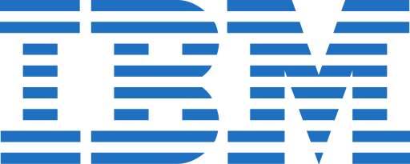

<!--
### Hi there 👋
**JessNah/JessNah** is a ✨ _special_ ✨ repository because its `README.md` (this file) appears on your GitHub profile.

Here are some ideas to get you started:

- 🔭 I’m currently working on ...
- 🌱 I’m currently learning ...
- 👯 I’m looking to collaborate on ...
- 🤔 I’m looking for help with ...
- 💬 Ask me about ...
- 📫 How to reach me: ...
- 😄 Pronouns: ...
- ⚡ Fun fact: ...
-->

<!-- "https://emojis.slackmojis.com/emojis/images/1471045852/842/hi.gif?1471045852" -->
#  Hey! I'm Jessica.

Welcome to my page!   I'm a software engineer working in <b>Toronto, Canada</b>  at  where I spend most of my time working on Business Automation Software in the Hybrid Cloud unit. 

I'm incredibly passionate and driven when it comes to coding and working on projects in a full-stack capacity. Being a tech enthusiast & a developer advocate, I am always open to collaborating on projects and innovative/disruptive ideas. So please feel free to reach out to me for anything at all!

 
<!--  -->

<!--  -->

#### A little of something else?

Something not coding related - I really enjoy digital art :) Take a look at my portfolio if you like.

<h3>Things I code with</h3>

  
   
  
  
  
  
  
  
  
  
  
  
  
  
  
  
  
  
  
  
  
  
  
  
  
  

### Some open source projects I contribute to

<table>
  <thead align="center">
    <tr border: none;>
      <td><b>🎁 Projects</b></td>
      <td><b>⭐ Stars</b></td>
    </tr>
  </thead>
  <tbody>
    <tr>
      <td><a href="https://github.com/pkgjs/parseargs"><b>Parseargs</b></a></td>
      <td></td>
    </tr>
	  <tr>
      <td><a href="https://github.com/carbon-design-system/ibm-cloud-cognitive"><b>Carbon-design-system/ibm-cloud-cognitive</b></a></td>
      <td></td>
    </tr>
  </tbody>
</table>

